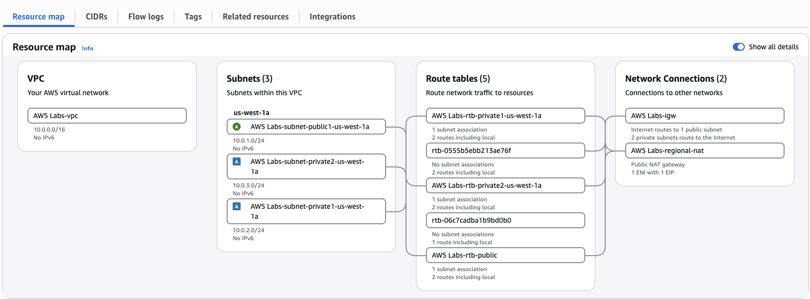
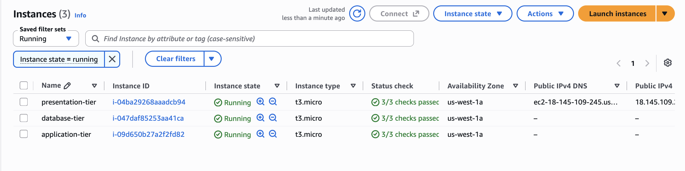

# AWS Three-Tier Architecture Lab

## Project Status
🚧 In Progress

## Overview
This project documents my hands-on deployment of a three-tier web architecture on AWS using separate presentation, application, and database tiers.

The goal of this lab is to gain practical experience with AWS networking, EC2, subnet segmentation, routing, security groups, Linux administration, and application connectivity.

## VPC Network Architecture

I created a custom AWS VPC using the `10.0.0.0/16` CIDR range with one public subnet and two private subnets. Separate route tables control traffic between the tiers, while an Internet Gateway provides public connectivity and a NAT Gateway allows resources in the private subnets to initiate outbound connections.

## EC2 Three-Tier Deployment

I deployed three EC2 instances across the VPC to separate the application into presentation, application, and database tiers.

- **Presentation Tier:** Deployed in the public subnet with a public IPv4 address so users can reach the web application.
- **Application Tier:** Deployed in a private subnet with no public IPv4 address and restricted to traffic from the presentation tier.
- **Database Tier:** Deployed in a separate private subnet with no public IPv4 address, with database access restricted to the application tier.

This design reduces unnecessary public exposure and separates each workload according to its role within the architecture.

## AWS Services
- Amazon VPC
- Amazon EC2
- Public and Private Subnets
- Internet Gateway
- NAT Gateway
- Route Tables
- Security Groups

## Build Documentation
Documentation and screenshots will be added as the environment is deployed.

## Lessons Learned
To be completed after the project.
